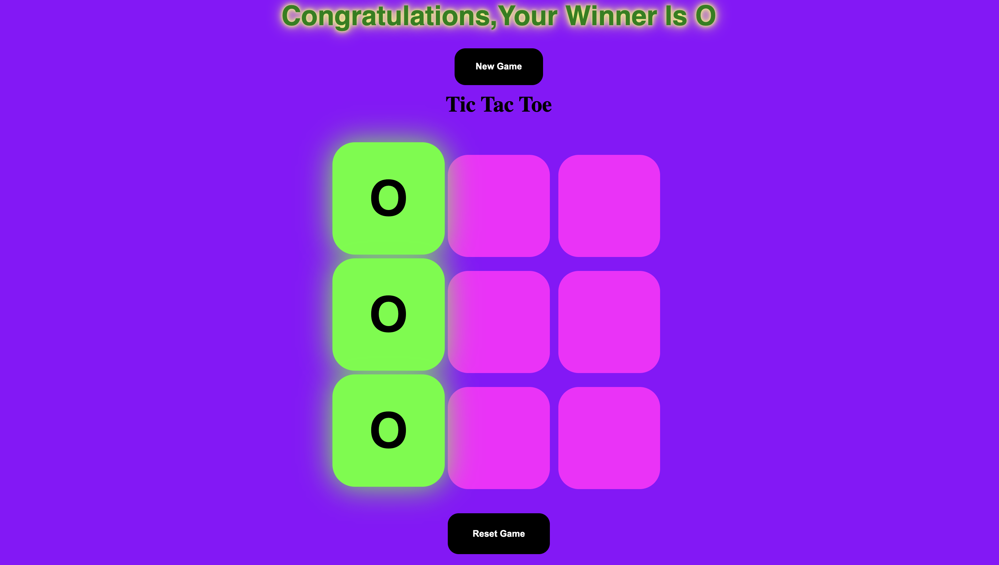

# ✨Tic Tac Toe

A glowing, animated version of the classic **Tic Tac Toe** game — built using **HTML**, **CSS**, and **JavaScript**. Features a neon theme, winner detection, draw logic, and smooth game animations that bring the experience to life.

---

## 🖼️ Game Preview



---

## 🔥 Features

- 🎮 Two-player game logic (X and O turns)
- ✅ Win detection with pop-out 3D highlight
- ⚠️ Draw detection when all boxes are filled with no winner
- 🎨 Neon-inspired glowing UI with smooth CSS animations
- ✨ Winner message with glowing animated text
- 🧼 Reset and New Game buttons for replayability
- ❗ Only winning tiles stay — all others reset after win

---

## 🛠️ Technologies Used

- HTML5 for structure
- CSS3 for layout, neon effects, and animations
- JavaScript (Vanilla) for game logic and interactivity

---

## 🚀 How to Run the Game

1. **Clone this repository:**
   ```bash
   git clone https://github.com/AryanOg0209/Tic-Tac-Toe.git
   cd Tic-Tac-Toe
2. Open index.html in any web browser.
✅ No server or installation needed — just run it locally!
```bash
Tic-Tac-Toe/
├── index.html       # Game UI and layout
├── style.css        # Neon styles, animations, and layout
├── first.js         # Game logic and interactivity
├── preview.png      # Screenshot used in README
└── README.md        # Project documentation
```

## 🎨 Visual & Animation Highlights

| Element                  | Style/Animation Details                                                                 |
|--------------------------|------------------------------------------------------------------------------------------|
| **Background**           | Neon Purple: `#8f00ff`                                                                   |
| **Player Text**          | Neon Yellow: `#f9f871`                                                                   |
| **Winning Tiles**        | Neon Green Highlight: `#39ff14`, glowing & pops out with scale + shadow                 |
| **Winner Message**       | Animated glowing text (`.glow-msg`) with pulsing shadows                                |
| **Buttons**              | Rounded, glowing neon colors with smooth transitions                                    |
| **Animations**           | Custom `@keyframes popUp` & `@keyframes glowText` for dynamic feel                      |

---
## 🧾 License
- Licensed under the MIT License.
- Feel free to use, modify, and share the project with credit.
---
## 🙌 Acknowledgements
- Built with 💜 using HTML, CSS, JavaScript and a whole lot of neon.
- Thanks to inspiration from classic arcade aesthetics and modern web magic.
---
